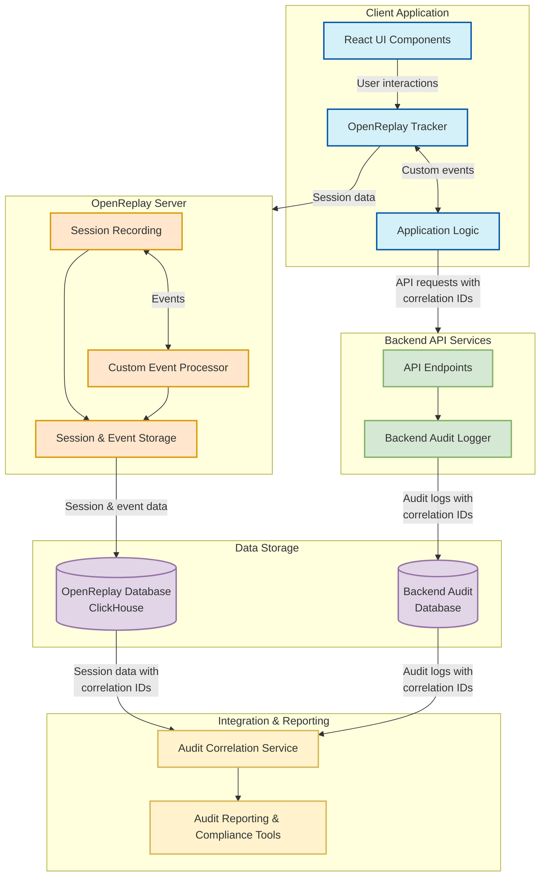

# OpenReplay Audit Architecture - Mermaid Diagram

## Overview

This document provides a Mermaid-based architecture diagram for implementing audit logging with OpenReplay in a government records management system.

## Architecture Diagram



## Key Components

1. **Client Application**
   - React UI Components: User interface elements for login, search, and record viewing
   - OpenReplay Tracker: Captures user interactions and custom events with correlation IDs
   - Application Logic: Handles business logic and ensures audit information is captured

2. **OpenReplay Server**
   - Session Recording: Captures full user sessions including UI interactions
   - Custom Event Processor: Processes events including correlation ID events
   - Session & Event Storage: Stores session recordings and events

3. **Backend API Services**
   - API Endpoints: Provides data access with correlation ID generation
   - Backend Audit Logger: Records detailed audit information with correlation IDs

4. **Data Storage**
   - OpenReplay Database: Stores session recordings and events (typically ClickHouse)
   - Backend Audit Database: Stores detailed audit logs from backend operations

5. **Integration & Reporting**
   - Audit Correlation Service: Links frontend sessions with backend audit logs
   - Audit Reporting & Compliance Tools: Generates reports for compliance requirements

## Data Flow

1. User interacts with the React UI, which is captured by the OpenReplay Tracker
2. Application Logic makes API requests with correlation IDs
3. OpenReplay Tracker sends session data to the OpenReplay Server
4. Backend API processes requests and logs audit information with correlation IDs
5. Session data and audit logs are stored in their respective databases
6. Audit Correlation Service links frontend sessions with backend logs using correlation IDs
7. Reporting Tools provide unified views of user actions for compliance and security

## Implementation Example

```typescript
// Initialize OpenReplay tracker with user ID
import Tracker from '@openreplay/tracker';

const tracker = new Tracker({
  projectKey: 'YOUR_PROJECT_KEY',
});

tracker.start();
tracker.setUserID(userId);

// Record correlation ID from API response
function recordApiCall(endpoint, correlationId) {
  tracker.event('api_request', { 
    endpoint,
    correlationId,
    timestamp: Date.now()
  });
}

// Example API call with correlation ID tracking
async function searchRecords(searchTerm, reason) {
  const response = await fetch('/api/search', {
    method: 'POST',
    headers: {
      'Content-Type': 'application/json',
    },
    body: JSON.stringify({
      term: searchTerm,
      reason: reason
    }),
  });
  
  const data = await response.json();
  
  // Record the correlation ID from the API response
  if (data.correlation_id) {
    recordApiCall('/api/search', data.correlation_id);
  }
  
  return data;
}
```